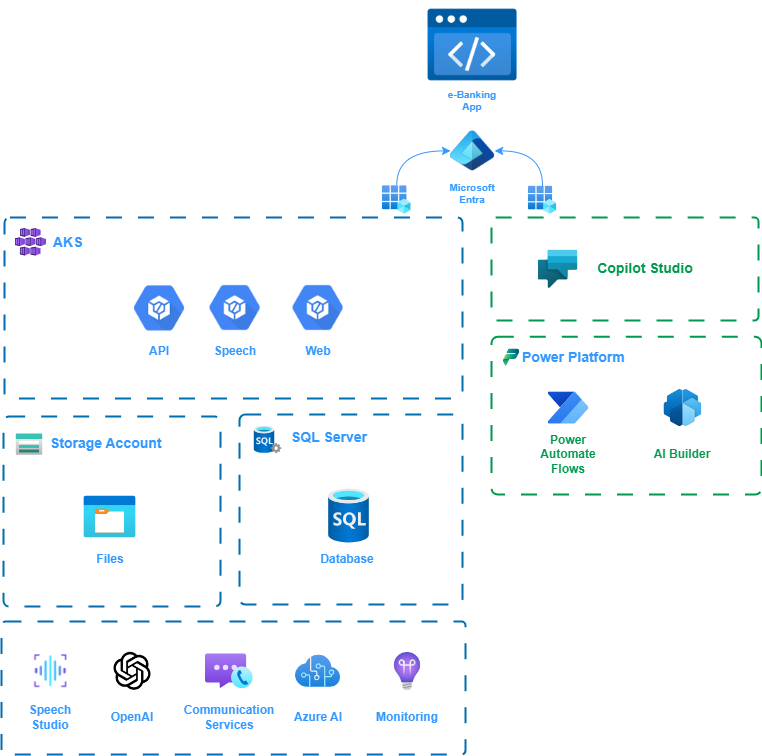

# CloudBank-Simple Copilot Demo

The purpose of this repo is to showcase a demo ebanking app, named CloudBank, we use it for building a Custom Copilot assistant using Copilot Studio. The newly created custom Copilot is utilizing our CloudBank's backend services in order to provide personalized financial activity insights
The following diagram describes all the relevant building blocks exist in this repo.



## Repo Content

In more detail, this repo contains,

For the CloudBank app,

- IaC in Bicep, to create the Azure environment ([here](./src/iac/))
- CloudBank backend services ([here](./src/app/api))
- CloudBank frontend app ([here](./src/app/web/))
- Text to Avatar API ([here](./src/app/speech-api/))
- Helm charts for deployment configs ([here](./src/app/charts/))
- Ops scripts for build and deploy ([here](./src/ops/))

for the Copilot Studio project

- Copilot Studio Topics ([here](./src/bot/topics/))
- Power Automate Flows ([here](./src/bot/flows/))
- AI Plugins (GPT Prompts) ([here](./src/bot/plugins/))
- Sample chat prompts ([here](./src/bot/sample_prompts.txt))


## Quickstart guide

### Prerequisites

#### Tools 
Although the following tools are described in `devcontainer.json` they are listed here as well in case of following a manual process

1. Azure CLI
2. Kubectl
3. Helm
4. Node JS
5. Docker
6. .NET 8 SDK
7. .NET EF Core cli

#### Configuration

`.env` file in the root folder has some basic configuration values used for location and naming of the Azure resources. Please, modify them accordingly.
In addition, avatar configuration requires the following changes.

1. Create an Azure OpenAI Service
2. Create a GPT text model deployment
3. Create Azure Communication Services resource
4. Complete the following config object, can be found [here](./src/app/web/static/avatar/js/chat.js)

```javascript
const config = {
    openAiEndpoint: "",
    openAiKey: "",
    openAiDeploymentName: "",
    iceServerUsername: "",
    iceServerCredential: "",
    cogSvcRegion: "",
    cogSvcSubKey: ""
}
```

You should also find and replace all the relevant appearances for the placeholder texts below,

- `<APP CLIENT ID>` - Microsoft Entra
- `<TENANT ID>` - Microsoft Entra
- `<APP CLIENT SECRET>` - Microsoft Entra
- `<YOUR SPEECH STUDIO KEY>` - Speech Studio
- `<YOUR SPEECH STUDIO REGION>` - Speech Studio


### Step 1. Deploy Infra

Execute the following command to deploy Azure infrastructure

```sh
pwsh run.ps1 deploy-infra
```

### Step 2. Deploy Apps

Build and then deploy backend and front end apps

```sh
pwsh run.ps1 build-api
pwsh run.ps1 build-web
pwsh run.ps1 build-speech

pwsh run.ps1 deploy-api
pwsh run.ps1 deploy-web
pwsh run.ps1 deploy-speech
pwsh run.ps1 deploy-ingress
```

### Step 3. Access e-Banking

Navigate to https://cloudbanksimple-aks.eastus.cloudapp.azure.com/app